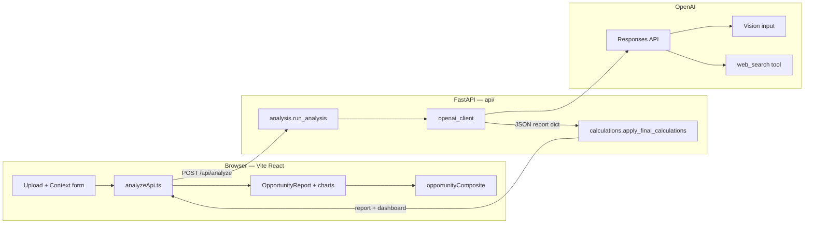

# Fashion Opportunity Intelligence — Architecture & Mental Model

This document describes how the application is structured, how data flows from the browser to OpenAI and back, and how each Python module under `api/` participates in that flow.

---

## 1. Product overview

**Goal:** Help buyers and merchandisers judge whether a **specific garment** (from a photo) is a **strong commercial opportunity** for a given **market, region, season, and assortment plan**.

**Inputs:**

- Garment **image** (encoded as base64 for the API).
- **Business context:** market, target customer, region, season, average selling price (ASP), planned assortment mix %, planned units, expected sell-through %.

**Outputs:**

- A structured **report**: garment attributes, trend scores (0–100), narrative (evidence, risks, recommendations), and **dashboard blocks** built or reconciled on the server (financial summary, score bars, assortment callouts, momentum trendline).
- The **hero “Opportunity score”** is computed in the **browser** from several trend fields (see §7).

---

## 2. High-level architecture

**Responsibility split:**

| Layer | Responsibility |
|--------|----------------|
| **React app** | UX, calling the API, rendering JSON, **Opportunity score** formula. |
| **FastAPI** | Auth to OpenAI, orchestration, **numeric hygiene**, **plan-aligned finance**, **derived UI payloads**. |
| **OpenAI** | Vision + reasoning + **hosted web search**; emits one **JSON-shaped** report (parsed from text output). |

---

## 3. Request and response shapes

Defined in `api/schemas.py` (Pydantic):

- **`BusinessContext`** — all numeric and string fields from the assortment form (validated ranges where applicable).
- **`AnalyzeRequest`** — `image_base64`, `image_mime`, `context: BusinessContext`.
- **`AnalyzeResponse`** — `{ "report": <dict> }`. The `report` is a large JSON object: model fields plus server-added keys (`financial_summary`, `trend_score_bars`, `assortment_dashboard`, `momentum_trendline`).

The frontend mirrors types in `src/lib/types.ts`.

---

## 4. End-to-end data flow

1. User selects an image and submits **business context**.
2. `src/lib/analyzeApi.ts` sends **POST** `{ image_base64, image_mime, context }` to **`/api/analyze`** (optional `VITE_API_BASE` prefix).
3. `api/analysis.py` → **`run_analysis`**:
   - **`call_openai_vision`** → raw **report** dict.
   - **`apply_final_calculations(report, context)`** → finalized **report**.
4. Client receives **`report`** and renders **`OpportunityReportView`**; **`opportunityComposite(report)`** computes the hero opportunity number.

---

## 5. OpenAI integration (`api/openai_client.py`)

- Uses **`POST https://api.openai.com/v1/responses`** (Responses API), not Chat Completions.
- **Instructions:** full system prompt from `api/system_prompt.py`.
- **Input:** user message with **business context JSON** + **image** (`input_image` with data URL).
- **Tools:** hosted **`web_search`** (with `search_context_size`, optional `user_location` from region).
- **`tool_choice: required`** so a search pass is part of the turn.
- **Output format:** plain **text** (JSON mode cannot be combined with `web_search` on this API). The assistant is instructed to return **one raw JSON object**.
- **`parse_json_util.extract_json_object`** strips markdown fences or extracts `{ ... }` and **`json.loads`** produces the Python dict.

**Environment:**

- `OPENAI_API_KEY` — required.
- `OPENAI_MODEL` — model supporting vision + Responses `web_search` (e.g. `gpt-4.1` per project defaults).

---

## 6. System prompt (`api/system_prompt.py`)

A single large string: role, rules for **web-grounded evidence**, required **JSON schema** (keys and nested shape), scoring calibration (region, season, customer, saturation, **confidence vs commercial scores**), **momentum_monthly_index** (seven points for the chart), and reminders not to output blocks the server builds (`financial_summary`, etc.).

The model **does not** receive a separate “search context blob” from a third-party search provider; search is **inside** the OpenAI request.

---

## 7. Frontend-only calculation: Opportunity score

**File:** `src/lib/format.ts` — **`opportunityComposite`**.

- **Not** returned from the API as its own field.
- **Base:** average of **six** integers from `trend_analysis`:
  - `trend_strength`, `commercial_viability`, `momentum_score`, `customer_fit`, `regional_relevance`, `seasonal_relevance`.
- **Saturation penalty:**  
  `saturationFactor = 1 - 0.52 * (saturation_risk / 100)`  
  then a mild **stretch from 50**: `round(clamp(50 + (base * saturationFactor - 50) * 1.18, 0, 100))`.

**Confidence** (`confidence_score`) is shown separately (with a mild display calibration in **`heroConfidenceScore`**) and is **not** part of the opportunity formula.

---

## 8. Server post-processing: `api/calculations.py`

**Entry:** `apply_final_calculations(report, ctx: BusinessContext)`.

### 8.1 Clamp trend scores

These keys under `trend_analysis` are coerced to integers in **[0, 100]**:

`trend_strength`, `commercial_viability`, `regional_relevance`, `seasonal_relevance`, `customer_fit`, `momentum_score`, `saturation_risk`, `confidence_score`.

### 8.2 Momentum monthly series

- If `momentum_monthly_index` is a list of **at least seven** numbers, each is clamped to **[40, 100]** (chart band).
- Otherwise the list is **removed** so the trendline builder uses the **fallback** curve.

### 8.3 Overwrite opportunity finance fields

Uses **`ctx`** (planned mix, units, ASP, sell-through) and the model’s **`recommended_mix_percent`** (clamped to [0, 100]):

| Output field | Rule |
|--------------|------|
| `opportunity_gap_percent` | `recommended_mix - planned_mix` (rounded 1 decimal). |
| `incremental_sales_opportunity` | Only **positive** gaps create incremental units: `planned_units * max(0, gap%) / 100 * ASP * (sell_through / 100)`. |
| `recommended_units` | If `planned_mix > 0`: `round(planned_units * (recommended_mix / planned_mix))`; else `planned_units`. |

The model’s prior values for these fields are **replaced** so numbers always match the buyer’s plan inputs.

### 8.4 Dashboard payloads (`_build_dashboard`)

- **`financial_summary`** — currency symbol from region heuristics, ASP, units, mix, gap caption, incremental revenue and compact string, sell-through caption; optional **`*_reasoning`** strings merged from the model’s **`financial_reasoning`** object (then removed from the report root).
- **`trend_score_bars`** — copies scores into bar items; **tone** (`positive` / `caution` / `neutral`) from simple thresholds (saturation uses a different cutoff).
- **`assortment_dashboard`** — adoption text, gap summary, incremental explanation, human-readable **calculation_formula** string.
- **`momentum_trendline`** — title from garment **category**; **subtitle** uses buyer **season** plus a **range label** from **`api/season_timeline.py`** (e.g. `FA26` → Aug–Oct 2026). **Dates** are seven checkpoints across that window, not fixed Jan–Mar. **Points** either from the seven `momentum_monthly_index` values (last point **forced** to `momentum_score`) or a **quadratic ease** from `max(40, end-26)` to `end`.
- **`sell_through_analysis`** — merged after the model response: planner **buyer_assumption_percent** from context, **AI** `ai_expected_sell_through_percent`, **incremental_revenue_at_ai_st** vs **planner_incremental_revenue**.

### 8.5 Narrative normalization (`_normalize_extended_fields`)

Defaults for evidence `source_channel`, risk `severity`, related-opportunity `tag` / `tag_variant`, optional `final_recommendation.headline` fallback, `report_metadata` keys.

---

## 9. API package file reference

| File | Purpose |
|------|---------|
| `__init__.py` | Package marker. |
| `schemas.py` | Pydantic request/response and `BusinessContext`. |
| `system_prompt.py` | LLM instruction string (JSON shape + business rules). |
| `openai_client.py` | Responses API call (vision + web_search + text JSON parsing). |
| `season_timeline.py` | Maps season codes (`FA26`, `SS26`, …) to seven chart dates + range label. |
| `parse_json_util.py` | Extract JSON object from model text. |
| `calculations.py` | Clamps, finance recomputation, dashboard assembly. |
| `analysis.py` | `run_analysis`: OpenAI → calculations → response; maps errors to HTTP. |
| `index.py` | Local combined app: CORS, `/api/health`, `/api/analyze` (and aliases). |
| `analyze.py` | Vercel-oriented FastAPI app for analyze routes (`/` and `/api/analyze`). |
| `health.py` | Vercel-oriented health-only app. |
| `_env.py` | Loads `.env` / `.env.local` for local development via `python-dotenv`. |

**Import graph (conceptual):**

- `index.py` / `analyze.py` → `analysis`, `_env`, `schemas`
- `analysis.py` → `openai_client`, `calculations`, `schemas`
- `openai_client.py` → `schemas`, `system_prompt`, `parse_json_util`
- `calculations.py` → `schemas` (`BusinessContext`)

---

## 10. Local development vs Vercel

**Local:**

- Run API: e.g. `uvicorn api.index:app --reload` (with repo root on `PYTHONPATH` / from repo root).
- `_env.py` loads `.env` for `OPENAI_API_KEY`, `OPENAI_MODEL`, `CORS_ORIGINS`, etc.
- Frontend: Vite dev server; `analyzeApi.ts` may use empty base (same origin) or `VITE_API_BASE`.

**Vercel** (`vercel.json`):

- Framework **Vite**; build outputs **`dist`**.
- Python deps from **`requirements.txt`** during install.
- **`api/analyze.py`** is configured as a **function** with extended `maxDuration` / `memory`.
- Environment variables are set in the Vercel project (no `.env` file required in production).

---

## 11. Mental model summary

1. **The model** answers: *What is this garment? How strong is the opportunity in this market, with the evidence I can find on the web?* It outputs **scores and prose**.
2. **The server** answers: *Given the buyer’s **plan** (mix, units, ASP, ST), what is the **numeric** gap, incremental revenue, and suggested units if we trust the model’s **recommended mix**?* It also **normalizes** scores and **materializes** chart/card payloads.
3. **The browser** answers: *What single **Opportunity** number should we show in the hero?* — a **deterministic blend** of six scores penalized by saturation.

Together, this keeps **judgment** flexible (LLM + search) while keeping **plan math** reproducible and aligned with user inputs.

---

## 12. Related files (outside `api/`)

| Path | Role |
|------|------|
| `src/App.tsx` | Wizard flow: upload → context → processing → report. |
| `src/lib/analyzeApi.ts` | HTTP client for `/api/analyze`. |
| `src/components/OpportunityReport.tsx` | Main report UI; uses `opportunityComposite`. |
| `src/components/MomentumChart.tsx` | SVG chart from `momentum_trendline.points`. |
| `requirements.txt` / `pyproject.toml` | Python dependencies for API and deploy. |

---

*Last updated to match the repository layout and behavior described above. If you change scoring formulas or API routes, update this document in the same PR.*
